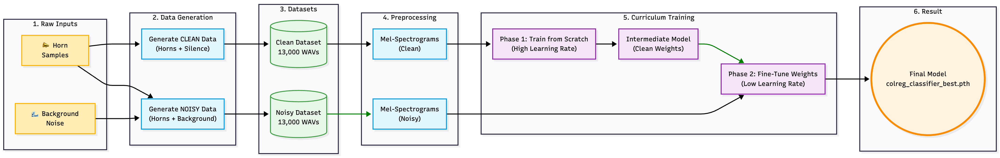

# 🚢 COLREG Sound Signal Classifier

A robust, containerized Machine Learning system designed to detect and classify maritime sound signals according to the **International Regulations for Preventing Collisions at Sea (COLREGs)**, specifically **Rules 34 & 35**.

This project uses a **Deep Learning (CNN + GRU)** architecture to identify critical navigation signals such as "Overtaking", "Altering Course", and "Not Under Command" directly from audio streams. It features an automated **Curriculum Learning** pipeline and a **web interface** for easy interaction.

## Workflow Diagram



## Team

- Oleksandr Yakovlev
- Hannu Kiviranta
- Eduard Rednic

## Key Features

- **Web Interface:** Beautiful Fallout/Inmarsat-C styled terminal UI
- **Curriculum Learning Pipeline:** Automatically trains on clean data first, then introduces realistic background noise
- **Synthetic Data Generator:** Programmatically creates thousands of labeled training samples
- **Hybrid CNN+GRU Architecture:** Combines Convolutional and Recurrent Neural Networks
- **Dockerized Workflow:** Zero-dependency setup with single-command deployment
- **Real-time Classification:** Upload files or record from microphone

## Technical Architecture

The system processes audio in three distinct stages:

1. **Preprocessing (The Ear):** Raw audio → **Mel-Spectrograms** (Time vs. Frequency visualization)
2. **Feature Extraction (CNN):** Identifies the "shape" of horn blasts
3. **Sequence Recognition (GRU):** Analyzes timing and order of blasts

## Supported Classes (COLREGs)

| Class | Signal Pattern | Meaning (Rule 34/35) |
|-------|----------------|----------------------|
| 0 | 1 Short | I am altering my course to starboard |
| 1 | 2 Short | I am altering my course to port |
| 2 | 3 Short | I am operating astern propulsion |
| 3 | 5+ Short | Danger / Doubt signal |
| 4 | 2 Long, 1 Short | I intend to overtake you on your starboard side |
| 5 | 4 Short, pause, 1 Short | Vessel turning round to starboard |
| 6 | 4 Short, pause, 2 Short | Vessel turning round to port |
| 7 | 1 Long | Blind bend / Power-driven vessel making way |
| 8 | 2 Long, 2 Short | I intend to overtake you on your port side |
| 9 | Long-Short-Long-Short | Agreement to be overtaken |
| 10 | 1 Long, 2 Short | Not Under Command / Restricted Ability |
| 11 | (Silence) | Background Noise Only |

## 📁 Project Structure
```
SinceAI_Kongsberg/
├── Deployment/              # Docker configuration
│   ├── Dockerfile
│   ├── requirements.txt
│   ├── train_pipeline.sh
│   └── start_web.sh
├── src/                     # Source Code
│   ├── data_gen.py          # Synthetic data generator
│   ├── preprocess.py        # Audio → Spectrogram converter
│   ├── train_colreg_classifier.py  # Training script
│   └── predictor.py         # Inference engine
├── web/                     # Web Interface
│   ├── index.html           # Frontend UI
│   ├── styles.css           # Fallout/Maritime styling
│   ├── app.js               # JavaScript logic
│   └── api_server.py        # Flask API backend
├── audio/                   # Input: Raw audio assets
├── models/                  # Output: Trained models
├── dataset/                 # Generated training data
└── README.md
```

---

## Quick Start

You have **two options** to run this project:

### Option A: Run Locally (Windows/Mac/Linux)

#### **Prerequisites:**
- Python 3.10+
- pip

#### **Setup:**

**Windows:**
```powershell
# Clone repository
git clone https://github.com/yourusername/SinceAI_Kongsberg.git
cd SinceAI_Kongsberg

# Create virtual environment
python -m venv venv
venv\Scripts\Activate.ps1

# Install dependencies
pip install -r Deployment/requirements.txt

# Start API server (Terminal 1)
python web/api_server.py

# Start web server (Terminal 2 - new window)
cd web
python -m http.server 8000
```

**Linux/Mac:**
```bash
# Clone repository
git clone https://github.com/yourusername/SinceAI_Kongsberg.git
cd SinceAI_Kongsberg

# Create virtual environment
python3 -m venv venv
source venv/bin/activate

# Install dependencies
pip install -r Deployment/requirements.txt

# Start API server (Terminal 1)
python web/api_server.py

# Start web server (Terminal 2 - new window)
cd web
python -m http.server 8000
```

**Open browser:** `http://localhost:8000`

---

### Option B: Run with Docker (Recommended)

See [Docker Deployment Guide](DOCKER_DEPLOY.md) for complete instructions on:
- Building the Docker image
- Training models
- Running the web interface
- Making predictions
- Troubleshooting

---

## Using the Web Interface

1. **Open** `http://localhost:8000` in your browser
2. **Go to TRAINING tab** and click **"🚀 RUN FULL PIPELINE"**
3. **Wait 15-45 minutes** for training to complete
4. **Go to CLASSIFIER tab** to:
   - Upload `.wav` files for classification
   - Record audio from your microphone
   - View real-time results with confidence scores

## Performance

- **Accuracy:** 70-95%+ on validation set
- **Processing Time:** <2 seconds per file
- **Noise Robustness:** Trained on wind, waves, thunder, rain, seagulls
- **Classes:** 12 COLREG signal types

## Development

### Local Development Workflow:

1. Make changes to `src/` or `web/` files
2. No need to rebuild - changes reflect immediately
3. Restart servers if needed (Ctrl+C, then rerun)

### Docker Development Workflow:

1. Make changes to files
2. Rebuild image: `docker build -t colreg-classifier -f Deployment/Dockerfile .`
3. Rerun container

## Acknowledgments

This project was developed as a solution for the **Turku Hackathon Challenge**, presented by **Kongsberg Maritime**. It aims to enhance maritime safety through AI-driven sound signal recognition.

## 📄 License

- MIT License

## Links

- **Demo:** [Live Demo URL]
- **GitHub:** https://github.com/HannuKiviranta/SinceAI_Kongsberg

---