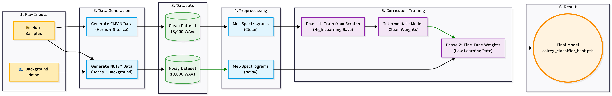

# 🚢 COLREG Sound Signal Classifier

A robust, containerized Machine Learning system designed to detect and classify maritime sound signals according to the **International Regulations for Preventing Collisions at Sea (COLREGs)**, specifically **Rules 34 & 35**.

This project uses a **Deep Learning (CNN + GRU)** architecture to identify critical navigation signals such as "Overtaking", "Altering Course", and "Not Under Command" directly from audio streams. It features an automated **Curriculum Learning** pipeline that trains on clean synthetic data before fine-tunes on noisy environments (wind, waves, engine noise) for real-world reliability.

## 👨‍💻 Team 
This project was built by the SinceAI team for the Turku Hackathon.
- Hannu Kiviranta - https://www.linkedin.com/in/hannu-kiviranta-12865739a/

- Eduard Rednic - https://www.linkedin.com/in/eduardrednic/

- Oleksandr Yakovlev - https://www.linkedin.com/in/oleksandr-yakovlev-student/


## 🌟 Key Features

-   **Curriculum Learning Pipeline:** Automatically trains on clean data first to learn signal patterns, then introduces realistic background noise to improve robustness.
    
-   **Synthetic Data Generator:** Programmatically creates thousands of labeled training samples (`.wav`) by mixing raw horn blasts with environmental textures.
    
-   **Hybrid Model Architecture:** Combines Convolutional Neural Networks (CNN) for spectral feature extraction with Gated Recurrent Units (GRU) for temporal sequence analysis.
    
-   **Dockerized Workflow:** Zero-dependency setup. A single command generates data, trains the model, and outputs a production-ready classifier.
    

## 🧠 Technical Architecture

The system processes audio in three distinct stages:

1.  **Preprocessing (The Ear):** Raw audio is converted into **Mel-Spectrograms**, visualizing the sound as an image (Time vs. Frequency).
    
2.  **Feature Extraction (CNN):** A Convolutional Neural Network scans the spectrogram to identify the "shape" of horn blasts and distinguish them from noise.
    
3.  **Sequence Recognition (GRU):** A Recurrent Neural Network analyzes the timing and order of the blasts (e.g., "Short-Short-Short" vs "Long-Short") to classify the COLREG signal.

### Workflow Diagram


## 📋 Supported Classes (COLREGs)

| Class ID | Signal Pattern      | Meaning (Rule 34/35)                                         |
|----------|----------------------|---------------------------------------------------------------|
| 0        | 1 Short              | I am altering my course to starboard.                        |
| 1        | 2 Short              | I am altering my course to port.                             |
| 2        | 3 Short              | I am operating astern propulsion.                            |
| 3        | 5+ Short             | Danger / Doubt (I fail to understand your intentions).       |
| 4        | 2 Long, 1 Short      | I intend to overtake you on your starboard side.             |
| 5        | 4 Short, 1 Short     | Vessel turning round to starboard.                           |
| 6        | 4 Short, 2 Short     | Vessel turning round to port.                                |
| 7        | 1 Long               | Blind Bend / Power-driven vessel making way.                 |
| 8        | 2 Long, 2 Short      | I intend to overtake you on your port side.                  |
| 9        | Long-Short-Long-Short              | Agreement to be overtaken.                                   |
| 10       | 1 Long, 2 Short      | Not Under Command / Restricted Ability.                      |
| 11       | (Silence)            | Background Noise Only.                                       |
| 12       | 8+ Short             | Random Short Blasts / General Alarm.                         |


## 📁 Project Structure

```
.
├── Deployment/              # Docker configuration files
│   ├── Dockerfile           # Image definition
│   ├── docker_instruction.md# Detailed deployment guide
│   └── train_pipeline.sh    # Orchestrator script
├── models/                  # Trained models appear here
├── audio/                   # Input: Raw .wav assets
│   ├── horns/               
│   └── noise/               
├── src/                     # Source Code
│   ├── data_gen.py          # Data Synthesizer
│   ├── preprocess.py        # Spectrogram Converter
│   ├── train_colreg_classifier.py # Training Logic
│   └── predictor.py         # Inference Engine
├── input_to_predict_COLREG/ # Input: Files to test
├── predictor_logs/          # Output: Prediction logs
└── README.md

```

## 🚀 Quick Start

This project is designed to run entirely within Docker.

### 📘 Detailed Instructions

For specific commands for **Windows**, **Mac**, and **Linux**, please read the dedicated guide: 👉 [**Deployment/docker_instruction.md**](https://github.com/HannuKiviranta/SinceAI_Kongsberg/blob/main/Deployment/docker_instruction.md)

### Basic Summary

1.  **Build Image:**
    
    ```
    docker build -t colreg-classifier -f Deployment/Dockerfile .
    ```
    
2.  **Train Model:**
    
    ```
    docker run --rm --gpus all `
    -v "${PWD}/audio:/app/audio" `
    -v "${PWD}/models:/app/models" `
    colreg-classifier
    ```
    
3.  **Predict Signal:**
    
    ```
    docker run --rm `
    -v "${PWD}/models:/app/models" `
    -v "${PWD}/input_to_predict_COLREG:/app/input" `
    -v "${PWD}/predictor_logs:/app/predictor_logs" `
    --entrypoint python `
    colreg-classifier `
    src/predictor.py --file /app/input/recording.wav --model /app/models/colreg_classifier_best.pth
    ```
    

## 📜 Acknowledgments

This project was developed as a solution for the Turku Hackathon Challenge, presented by Kongsberg Maritime. It aims to enhance maritime safety through AI-driven sound signal recognition.

